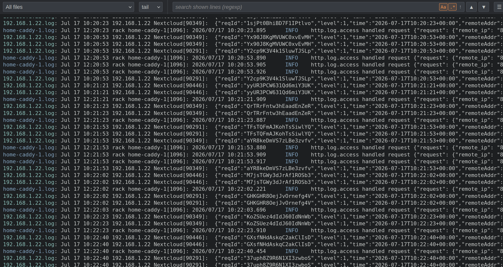

<p align="center">
  
</p>

# Tailon-ng

[](https://goreportcard.com/report/github.com/tbocek/tailon-ng)
[](https://github.com/tbocek/tailon-ng/blob/main/LICENSE)

> **This is a fork of [gvalkov/tailon].** It keeps the purpose — tail and grep your
> log files from the browser — but rebuilds the project around the Go standard
> library: **two third-party dependencies** (pure-Go xz/zstd decoders for rotated
> archives, nothing else), no JavaScript toolchain, and a single static binary.
> [How this fork differs from the original](#how-this-fork-differs-from-the-original)
> spells out exactly what changed and why you might pick it over upstream.

Tailon-ng is a webapp for looking at and searching through log files from your
browser. It serves files — single files, globs or whole directories — and lets
you **tail** them live or **grep** through them, with a regular-expression
filter (which can be inverted). Reading, following and filtering are all done
natively in Go: tailon-ng never shells out to `tail`, `grep` or any other tool.
It is almost entirely Go standard library — the only third-party code is two
small, pure-Go decompression libraries ([ulikunitz/xz] and [klauspost/compress]
for zstd) used to read rotated archives — and ships as a single static binary.

**Security posture, up front:** tailon-ng has **no built-in authentication** —
anyone who can reach its port can read the files it serves, so bind it to
localhost (`-b 127.0.0.1:8080`) or put it behind an authenticating reverse proxy.
And it **never shells out** to `grep`, `sed`, `awk` or anything else — tailing
and filtering run in-process in Go ([RE2]), so nothing typed in the UI can reach
a shell. More in [Security](#security).

## How this fork differs from the original

The "original" here is **[gvalkov/tailon]**, the Go project this repository was
forked from — *not* the older Python [tailon-legacy] (see [Project
lineage](#project-lineage)). Same job, far less machinery:

| Area | [gvalkov/tailon] (upstream) | This fork |
| --- | --- | --- |
| Third-party dependencies | Vue.js, SockJS, build-time tooling | **Two** pure-Go decompression libraries (xz, zstd); everything else is standard library |
| Frontend | Vue.js single-page app | Framework-free vanilla HTML/CSS/JS |
| Live updates | SockJS | Server-Sent Events |
| Frontend assets | produced by a code-generation/build step | embedded with `//go:embed`, no build step |
| Configuration | configuration file | command-line flags only |
| Releases | GoReleaser | a small [`release.sh`](release.sh) + GitHub Actions |
| Tests | Python integration tests | Go unit tests (`go test ./...`) |

The result is a smaller, self-contained binary you can read and audit in one
sitting — no Node/npm, no asset pipeline, nothing to vendor. Prefer the original's
Vue UI and configuration-file setup? Use [gvalkov/tailon]. Want a tiny,
dependency-free log tailer? Use this.

## Install

Install the latest release binary for your OS and architecture (Linux and
macOS, Intel and Apple Silicon). The script installs to `/usr/local/bin`, or
`~/.local/bin` when that isn't writable:

```
curl -sL https://raw.githubusercontent.com/tbocek/tailon-ng/main/install.sh | bash
```

Or install from source with Go (1.26+):

```
go install github.com/tbocek/tailon-ng@latest
```

Prebuilt binaries are also attached to every entry on the [releases] page.

## Usage

Each file can be viewed in two modes — **tail** (follow the file live, like
`tail -f`) or **grep** (read the whole file from the start) — and narrowed with
an optional regular-expression **filter** that can be inverted (both set in the
UI). Tailon-ng itself is configured entirely with command-line flags.

To get started, run tailon-ng with the files or directories you want to monitor.
Each argument is a file, a directory, or a shell glob — `*` matches within a
directory and `**` across them — and a single argument can list several,
comma-separated:

```
tailon-ng /var/log/apache/access.log /var/log/apache/error.log /var/log/messages
tailon-ng /var/log/apache/,/var/log/nginx/
tailon-ng "/var/log/**.log"
```

Directories are served recursively — every file beneath them (including in
subdirectories) is available, and new files are picked up as they appear. The
file selector also lists each subfolder, so you can tail or grep just the logs
beneath one of them.

Rotated and compressed logs are handled the way you'd want: files that are no
longer written to (`.gz`, `.bz2`, `.xz`, `.zst`, numeric `.1`, date-stamped
`-YYYYMMDD`, `.old`, `.bak`) are listed as *archived* but excluded from live
tailing, so compressed bytes never pollute the stream. Selecting one greps it
with the compression decoded transparently, and the **grep-all** mode searches
live files *and* every archive together.

Tailing is push-based on Linux: appended lines reach the browser in
milliseconds via **inotify** (through the standard library's `syscall` package
— no extra dependency), with a polling fallback wherever notifications aren't
available (other platforms, network filesystems, watch-limit exhaustion). The
notification only *wakes* the tailer; the read loop stays the source of truth,
so nothing is ever missed.

The frontend exploits the fact that log files are **append-only**: every
single-file view is cached in the browser together with the byte offset read so
far, keyed by file, mode and filter. Switching between files, or between tail
and grep, re-renders instantly from the cache and asks the server only for the
bytes that arrived since — and a fully-read archive is never requested again.
If a file shrank or was replaced (rotation), the server signals a reset and the
view rebuilds from scratch.

Grep loads show a real **0–100 progress bar** — a thin line under the toolbar
driven by the server's byte progress (lines the filter drops still advance it,
since it measures bytes read). While a load streams in, the view holds still
instead of chasing the bottom, then jumps to the end once at EOF — unless you
already started scrolling. Compressed archives, whose decoded size isn't known
up front, show an indeterminate sweep instead. The toolbar's top-right corner
shows the **running version**, linking to the releases page.

The web UI's file selector includes an **All files** entry (selected by default)
that streams every served file at once, each line prefixed by its file (click
the prefix to jump into that file's grep — scrolled to, and highlighting, that
very line) and the streams **merged in timestamp order**. Several common formats are recognized at
(or near) the start of each line — ISO 8601 / RFC 3339, `YYYY-MM-DD HH:MM:SS`,
slash-separated dates, Apache/CLF, Unix `ctime` and syslog (RFC 3164). The format
is detected per file from its first lines (not guessed from a single one), and a
line without a recognizable timestamp keeps its file's previous one, so
multi-line entries stay together. Handy when you're watching logs from many
hosts together.

Lines are interactive: hovering highlights the line under the cursor, and
clicking selects it — **Ctrl+click** toggles lines individually, **Shift+click**
selects a range, clicking a selected line (or pressing **Escape**, or clicking
the empty space below the log) clears. **Ctrl-C** then copies exactly the
highlighted lines, confirmed by a small toast — handy for pasting a few
relevant entries into an issue or a chat. A normal mouse drag still selects and
copies text natively.

### Example: central syslog server

A common deployment is a host that aggregates logs from many machines via
[syslog-ng] (or rsyslog) into a directory tree such as `/var/log/remote`. Point
tailon-ng at the directory to serve everything under it recursively:

```
tailon-ng /var/log/remote/
```

Every file beneath it — including per-host subdirectories — shows up in the file
picker, and **All files** streams them all merged in timestamp order.

Tailon-ng's server-side functionality is summarized entirely in its help message:

[//]: # (run "./tailon-ng --help" to update the next section)

[//]: # (BEGIN HELP_USAGE)
```
Usage: tailon-ng [options] <path> [<path> ...]

Tailon-ng is a webapp for searching through log files from your browser.

  -b, --bind string            Address and port to listen on (default ":8080")
  -h, --help                   Show this help message and exit
  -r, --relative-root string   Webapp relative root (default "/")

Tailon-ng is configured entirely through command-line flags.

Each <path> is a file, a directory, or a shell glob, where "*" matches within a
directory and "**" across them (so "/var/log/**.log" finds .log files at any
depth). Directories are served recursively, and new files are picked up as they
appear. Several paths can be given as separate arguments or comma-separated.

Rotation leftovers (.gz, .bz2, .xz, .zst, .1, -YYYYMMDD, .old, .bak) are listed
but excluded from live tailing and plain grep. The web UI's grep-all mode also
searches them, decompressed transparently.

On Linux, appended lines are pushed instantly via inotify; elsewhere, and on
filesystems without notification support, tailon-ng falls back to polling.

Example usage:
  tailon-ng /var/log/syslog /var/log/auth.log
  tailon-ng /var/log/nginx/,/var/log/apache/
  tailon-ng /var/log/remote/
  tailon-ng "/var/log/**.log"
  tailon-ng -b 127.0.0.1:8080 /var/log/messages
```
[//]: # (END HELP_USAGE)

## Security

**No built-in authentication.** By default tailon-ng is reachable by anyone who
can connect to its address and port, and it serves — and lets clients download —
exactly the files you point it at. Bind it to localhost (`-b 127.0.0.1:8080`) or
put it behind an authenticating reverse proxy. It is a log viewer, not a gateway.

**No shell, no external commands.** Tailon-ng never runs `tail`, `grep`, `sed`,
`awk` or any subprocess; reading, following and filtering are all done in-process
in Go. The UI filter is a Go ([RE2]) regular expression, so nothing entered in
the browser can cause shell or command injection.

**Safe downloads.** Files are served as plain-text attachments with
`X-Content-Type-Options: nosniff`, so a log line that happens to look like HTML
can't be rendered as script in your browser.

## Development

### Frontend

The frontend is plain, framework-free HTML, CSS and JavaScript: four flat files
in `frontend/` (two Go templates, `main.css`, `main.js`), embedded into the
binary at compile time with `//go:embed` (see `frontend.go`). The favicon is an
inline SVG data URI in `base.html` — no image files at all. There is no build
step or toolchain — edit the files directly and rebuild the binary. The UI
talks to the backend over Server-Sent Events.

### Backend

The backend is written in straightforward Go, almost entirely standard library:
flag parsing, configuration, HTTP serving, access logging, file following,
regexp filtering and gzip/bzip2 decoding for the Server-Sent Events stream. The
only third-party dependencies are [ulikunitz/xz] and [klauspost/compress],
which decode `.xz` and `.zst` archives. File reading and following live in
`tailer.go`; the inotify wake-up path (Linux, raw `syscall` — no dependency) in
`watcher_linux.go`, with the polling fallback in `watcher_other.go`.

### TODO

* Basic and digest authentication.

* Add a 'command' filespec - e.g. `"command,journalctl -u nginx"`.

* Better configuration dialog.

* Add interface themes - e.g. light, dark and solarized.

* Add ability to change font family and size.

* Windows support (can use one of the Go tail implementations).

* Implement [wtee].

### Versioning

Release binaries are stamped with their git tag at build time
(`-ldflags "-X main.version=..."` in the GitHub Actions workflow), which is what
the UI's version badge shows. Local builds show `dev`; to stamp one yourself:

```
go build -ldflags "-X main.version=$(git describe --tags --always --dirty)"
```

### Testing

Run the unit tests with `go test ./...`.

## Project lineage

Three distinct projects have carried the **tailon** name; this is the third, and
the source of the recurring "wait, which tailon?" confusion:

1. **[tailon-legacy]** — the first one, written in Python + Tornado with a custom
   TypeScript frontend.
2. **[gvalkov/tailon]** — a full rewrite in Go with a Vue.js + SockJS frontend,
   configured through a file and released with GoReleaser. **This is the upstream
   this repository is forked from.**
3. **This fork (tailon-ng)** — drops the third-party frontend and tooling for a
   framework-free, dependency-free, single static binary. See [How this fork
   differs from the original](#how-this-fork-differs-from-the-original) for the
   point-by-point comparison.

## Similar Projects

* [clarity]
* [errorlog]
* [log.io]
* [rtail]
* [tailon-legacy]

## License

Tailon-ng is released under the terms of the [Apache 2.0 License].

[gvalkov/tailon]: https://github.com/gvalkov/tailon
[tailon-legacy]:  https://github.com/gvalkov/tailon-legacy
[syslog-ng]:      https://www.syslog-ng.com/
[clarity]:        https://github.com/tobi/clarity
[wtee]:           https://github.com/gvalkov/wtee
[releases]:       https://github.com/tbocek/tailon-ng/releases
[errorlog]:       http://www.psychogenic.com/en/products/Errorlog.php
[log.io]:         http://logio.org/
[rtail]:          http://rtail.org/
[RE2]:            https://github.com/google/re2/wiki/Syntax
[ulikunitz/xz]:   https://github.com/ulikunitz/xz
[klauspost/compress]: https://github.com/klauspost/compress
[Apache 2.0 License]: LICENSE
